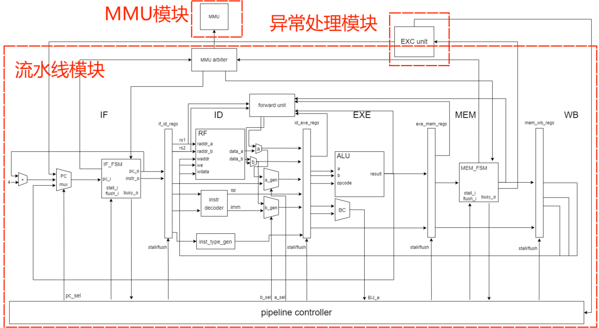
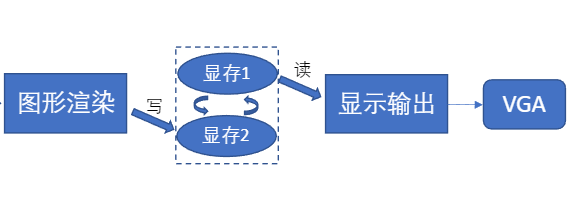

# 计算机组成原理大实验报告

小组：grp09

成员：梁业升、田仁睿、王文琦

<video src="assets/game.mp4"></video>

**这里是我们的 FlappyBird Demo 视频播放[地址](https://user-images.githubusercontent.com/74406572/215109972-b71e1d14-f396-4614-a454-ebb9b76f74b0.mp4)，大家可以点击观看。**

## 一、实验概述

### 实验目标

在 THINPAD 硬件实验平台上，实现一个支持 RV32I 指令集的流水线 CPU ，支持中断异常、MMU、VGA 外设，并能够运行 ucore 。

### 实验内容

+ 支持 RV32I 指令集的流水线 CPU
+ 支持中断异常、MMU
+ 支持 VGA 等外设扩展

### 效果展示

+ 成功运行各版本监控程序
+ 成功运行 ucore
+ 在板子上玩有趣的 Flappy Bird 小游戏

## 二、数据通路

以下为我们 CPU 的数据通路（部分信号略去）：

## 三、流水线模块

流水线采用经典的五级流水线设计，分为 IF、ID、EXE、MEM、WB 五个阶段。

### IF 阶段

IF 阶段实现了根据当前 PC 从内存读取指令，更新下一条指令 PC 、指令和 PC 向 ID 阶段传递的功能。

当访存出现异常时，产生异常信息并向后传递，留待 MEM 阶段处理。

### ID 阶段

ID 阶段接收来自 IF 阶段的指令，完成复杂的指令译码和读取寄存器值，产生相应的控制信号并向后传递。

ID 阶段还需要接收来自后续阶段的数据前传，以解决数据冲突问题。

遇到不合法的指令，产生异常信息并向后传递，留待 MEM 阶段处理。

### EXE 阶段

EXE 阶段接收来自 ID 阶段的 ALU 操作数和操作码，完成 ALU 计算后将计算结果向后传递。

EXE 阶段需要把将要写入寄存器的 ALU 计算结果向前传递，解决数据冲突。

除此之外，EXE 阶段还完成了跳转条件和跳转地址的计算。相关控制信号首先传递给 pipeline controller ，再传递给 IF 阶段实现跳转指令，并产生气泡冲刷流水线。

中断触发时，产生异常信息并向后传递，留待 MEM 阶段处理。

### MEM 阶段

MEM 阶段接收来自 EXE 阶段的 ALU 计算结果，对内存、CSR 进行读写，把寄存器写信号向后传递。

MEM 阶段需要把将要写入寄存器的访存结果向前传递，解决数据冲突。

由于 MEM 阶段是最后可能产生异常、且首个会产生影响（修改内存、寄存器等）的阶段，所以在该阶段处理异常中断。

当访存、读写 CSR 寄存器出现异常时，在当前阶段直接进行异常处理。

### WB 阶段

WB 阶段完成简单的寄存器写。同时需要实现 bypass 功能，解决数据冲突。

### forward unit

实现数据前传，通过判断 ID 阶段读取的寄存器地址与 EXE 、MEM 阶段写寄存器地址是否相等，产生数据选择信号传递给 ID 阶段。

### pipeline controller

流水线控制器用于接收来自各阶段的控制信号，产生整个流水线的控制信号（stall、flush、next_pc 等）。例如，访存进行时，使用 stall 信号暂停流水线；条件跳转时，产生气泡冲刷跳转指令之后的指令。

## 四、异常处理模块

异常处理模块负责：

- CSR 寄存器的读写及其权限保护、WARL 及 WLRL 的处理
- 判断中断产生并给出信号，接受同步异常信号，并根据优先级进行处理
- 处理异常返回（return from trap）
- 处理异常委托（delegation）

### CSR 寄存器的读写

CSR 寄存器的读写权限编码于 CSR 地址中，根据 CSR 地址和当前特权等级即可判断是否可读/写，并给出读/写是否有效的信号 `invalid_r_o` 和 `invalid_w_o`。

由于 `CSRRW` 等指令需要在读出旧值的同时写入新值，因此同时给出读、写两个接口。在可读的情况下，根据读地址 `csr_raddr_i` 给出 CSR 寄存器的值；在可写且写使能 `csr_we_i` 为 1 的情况下，根据目的 CSR 寄存器的写要求（WARL、WLRL）对输入数据进行判断后视情况写入。

有几个需要实现的 S 态寄存器实际上是对应 M 态寄存器的子集，包括 `sstatus`、`sie` 和 `sip`。读时给出对应 M 态寄存器对应字段的值，写时写到对应 M 态寄存器对应字段即可。

### 处理异常

根据 `mie` 和 `mip` 的值，根据优先级和当前特权等级确定是否发生需要处理的中断，并给出信号 `interrupt_occur_o`。当输入的使能信号 `exc_en_i` 为 1 时，进行异常处理。若有需要处理的中断，则处理此中断，否则根据 `sync_exc_code_i` 处理同步异常。

运行 uCore 需要实现 S 态异常委托。根据当前特权等级、当前发生的异常原因及是否为中断，在 `mideleg` 或 `medeleg` 寄存器中若对应的位为 1，则将异常委托给 S 态，否则由 M 态处理。

根据委托情况，处理异常的操作如下：

- 为软件提供异常原因
  - 将异常原因写到 `mcause`（或 `scause`）中
  - 将输入的值写到 `mtval`（或 `stval`）中
- 保存现场
  - 将当前的 PC 保存到 `mepc`（或 `scause`）
  - 将当前特权等级保存到 `mstatus.mpp`（或 `mstatus.spp`）
  - 将当前的 `mstatus.mie`（或 `mstatus.sie`）保存到 `mstatus.mpie`（或 `mstatus.spie`）
  - 将 `mstatus.mie`（或 `mstatus.sie`）设置为 0 以禁用中断

同时，根据 `mtvec`（或 `stvec`）给出要跳转到的异常处理程序的地址（`next_pc_o`）及对应的特权等级（M 或 S，`nxt_privilege_o`）。

### 处理异常返回

处理异常返回（`mret` 或 `sret` 指令）时，根据当前特权等级，设置对应的 CSR：

- 将 `mstatus.mie`（或 `mstatus.sie`）恢复为 `mstatus.mpie`（或 `mstatus.spie`）
- 将 `mstatus.mpie`（或 `mstatus.spie`）设置为 1
- 将 `mstatus.mpp`（或 `mstatus.spp`）设置为 U 态

同时，给出要跳转到的 PC（`mepc` 或 `sepc`）和对应的特权等级（`mstatus.mpp` 或 `mstatus.spp`）。

## 五、MMU

MMU 负责：

- 决定是否需要进行地址翻译
- 根据页表，将虚拟地址翻译为物理地址
- 判断页表项是否合法
- 判断物理地址是否合法
- 作为 Wishbone master 进行总线访问，写入/读出数据

根据 `satp.mode`，决定是否进行地址翻译。获取页表项、进行地址翻译的过程根据 privilege spec 的说明进行即可，在此不再赘述。

根据实践经验，当物理地址不合法时最好实现对应的访问异常，方便调试。物理地址合法的范围为所有有效的硬件地址（SRAM、UART、GPIO、VGA、CSR 等）。

## 六、外设模块

外设部分主要在 `external` 目录下，我们完成了 VGA、板载 flash 以及 GPIO 的拓展，并且自己编写了经典游戏 `FlappyBird` ，可以在用户态下应用这些外设成功游玩小游戏。

### VGA

vga 部分主要包括 `vga_pic` 和 `vga_selector` 两个模块：

- `vga_pic` 模块的作用主要是根据扫描的行同步信号、列同步信号以及**分辨率信号**确定应当读取的显存区域的位置。
- `vga_selector` 模块与 wishbone 总线相连。它的本质是关于 vga 硬件的一些属性寄存器，包括当前渲染的显存区域 `bram_sele_reg` ，当前显示的渲染分辨率 `vga_scale_reg`。同时，这些寄存器被映射到了总线上相应的地址，可以由用户程序来改写。

**VGA 的渲染使用了双缓冲技术。**本次大实验，我们选取了两块读写深度为 8 bit，大小为 128Mbyte 的 blockram。在用户实时改变画面内容的时候，可以先向非显示区的缓冲片写入需要显示的内容，等待一整幅画面刷新完之后，得到 `vga_end` 信号，再将另外一个缓冲区的数据接到 vga 扫描上。这一部分是由 `vga_selector` 完成的。这样做可以完美避免画面撕裂的情况，同时也可以节约从一块缓冲区整个复制到另一块缓冲区的时间。

### Flash

flash 部分主要包括 `flash_controller` 一个模块。

- `flash_controller` 模块和 wishbone 总线相连。因为 flash 的写时序比较复杂，由云平台写入即可，总线主要处理对于 flash 的读时序。根据实验发现，在 20M 的时钟下，flash 是无法完成连续读写的，为了保险起见，我们采取了**两周期读**的方式来处理。其余部分和 `sram_controller` 类似。唯一不同的是，因为 flash 的读写开启了 **Byte** 模式，所以我们并没有处理总线上非对齐的地址，只是在读的过程中，将读取的 8bit 的数据放在总线数据上相应的 sele 位即可。

### GPIO

GPIO 部分主要包括 `gpio_controller` 一个模块。

- `gpio_controller` 内部将板载的 `push_button`、四个按键、32位拨码开关硬连线到内部，映射为总线上相应的地址。当用户程序访问约定的地址时，`gpio_controller` 会读取板载按钮的状态，然后返回到总线上。这样就实现了所有的外设访问全部经由总线的统一。我们采用了**两周期读**的方式来处理。

### 拓展：FlappyBird

FlappyBird 小游戏使用了上述三种外设，使用了 c 语言编写并且翻译成二进制，能够成功地运行在监控程序上。游戏的大致编写思路如下，具体的实现细节可以参考仓库源码中的注释部分。

- 首先，游戏的图片素材全部来自于 flash 外设。在需要使用到该素材的时候，可以去 flash 外设的相应地址加载。
- 其次，游戏的渲染 Pipeline 如下：
  - 游戏的逻辑帧完成计算。
  - 到 flash 中寻找素材地址。
  - 渲染当前缓冲区，包括：删掉当前画布**（缓冲区）**上消隐的部分、从 flash 中加载资源重新写到画布**（缓冲区）**上。
  - 交换显存页面，**使刚刚渲染的缓冲区成为显示区，上一帧的显示区成为缓冲区。**
  - 然后重复开始游戏的逻辑帧，直到游戏结束（胜利或者是判负）。
- 在游戏的逻辑帧计算中，需要完成：对 GPIO 的检测（是否按下 push button 让小鸟飞起来）、小鸟高度的变化、小鸟形态的变化、绿色柱子的移动、小鸟是否触底、小鸟是否碰柱等部分的计算。总体来说，这些计算的延时**比较小**，如果不手动加入延时的话，可能会导致帧率过快，画面不协调。所以一般可以在逻辑帧结束过后，**手动插入空指令或者无用的循环指令**，给逻辑帧延时。

